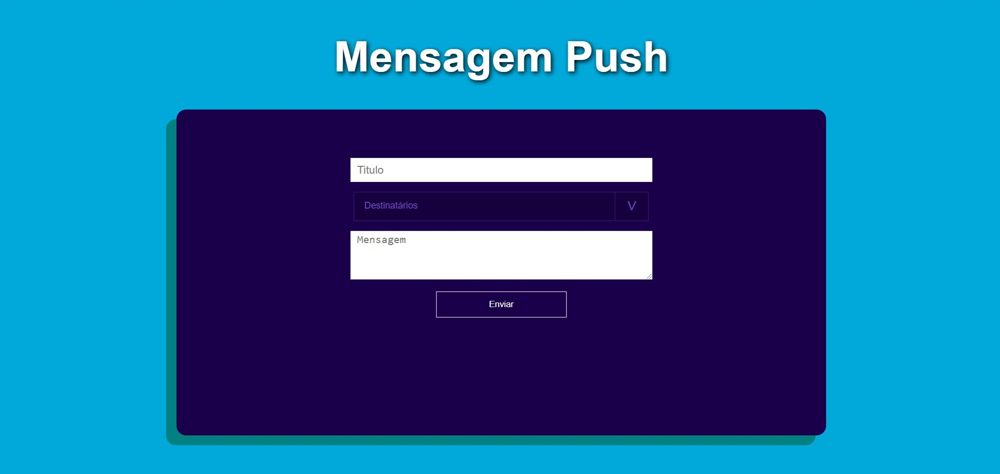
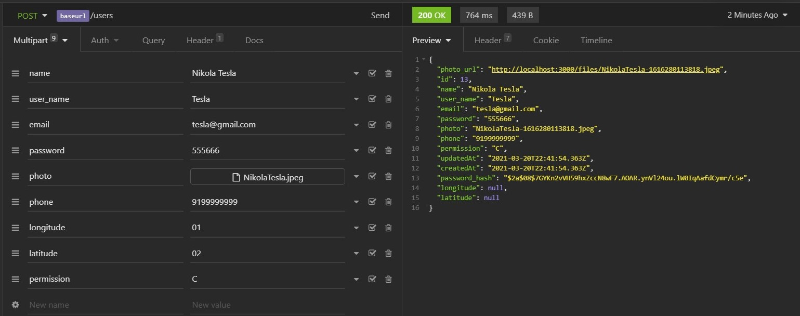
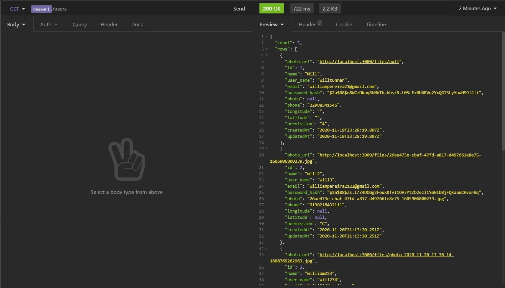
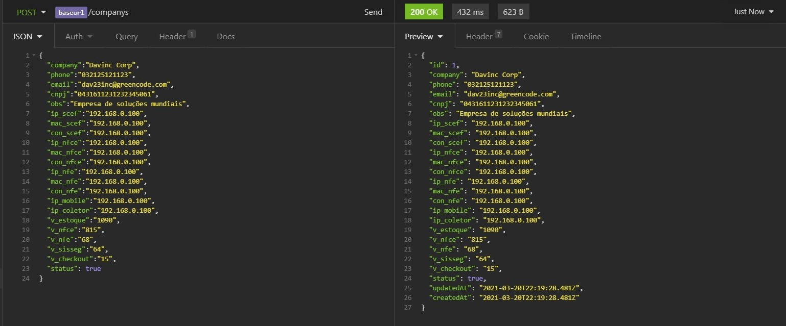
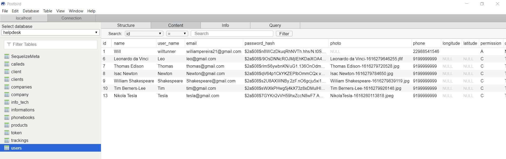
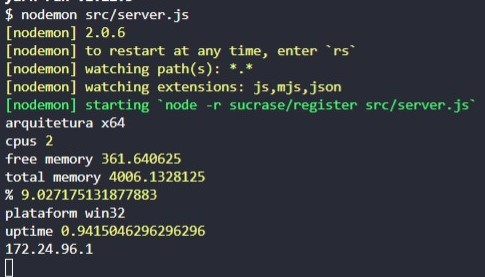

# Projeto FindHero
> Projeto criado em base de estudo de consumo de api da marvel. 
> https://developer.marvel.com/

#### Aplicativo feito com react native, expo, styled components, consumo de api

## Imagens do projeto

## Como usar:
1. Abra o projeto
2. Use: "yarn" para baixar o node_modules
3. Depois use: "expo start" para iniciar o projeto

## Conteudo desse estudo
* JavaScript
* Styled Components
* expo
* Consumi de api
* Front-End
